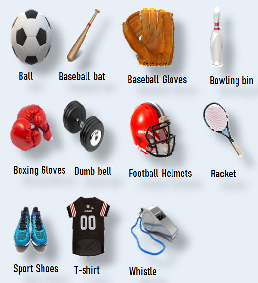
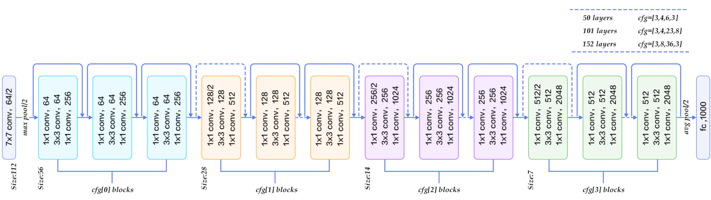
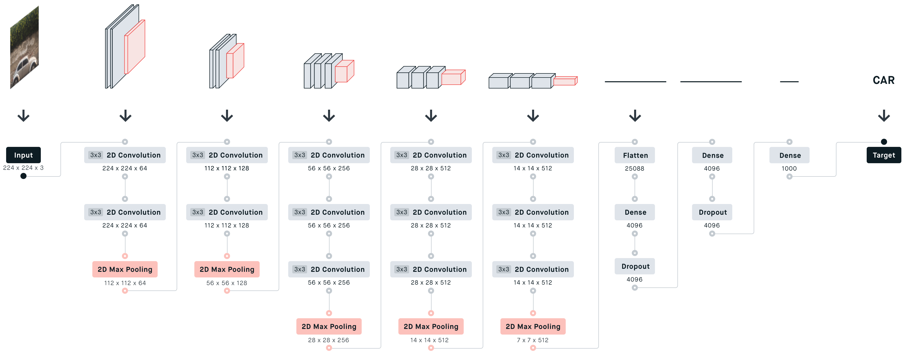
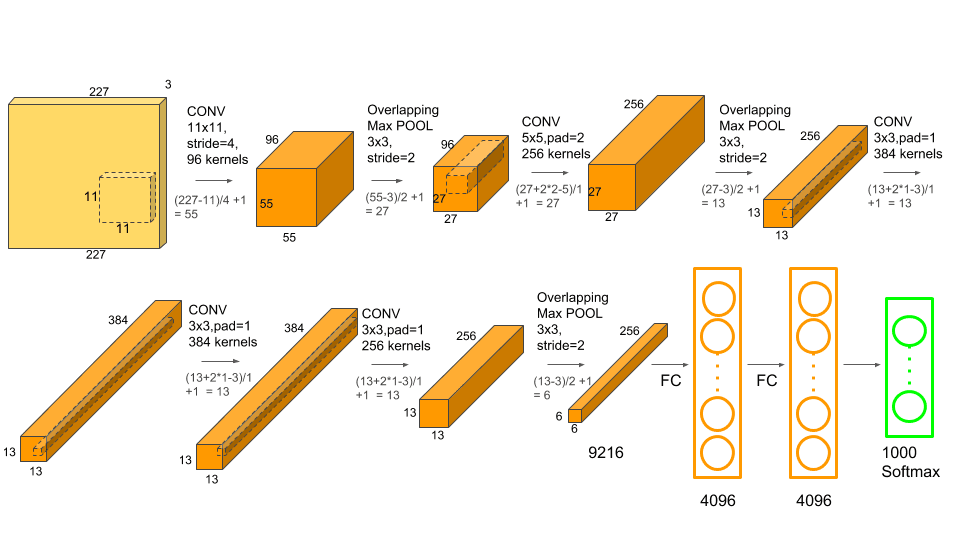
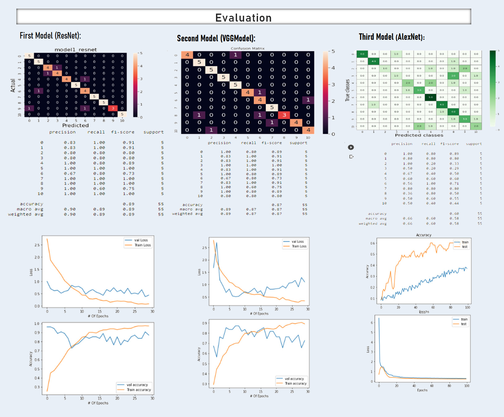
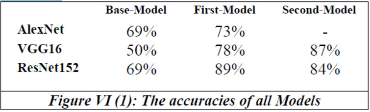

# Sports Products Multi-Class Classification

## INTRODUCTION:
Society's interest in sports is expanding, and there are many sports available now that many people are unaware of. Our research will use convolutional neural networks (CNNs) and several deep learning approaches and pre-trend models to perform multi-class classification for 11 different types of sports or their equipment, such as a ball, baseball bat, baseball gloves, bowling bin, dumbbell, boxing gloves, football helmets, racket, sports shoes, t-shirt, and whistle. 

## PROBLEM DEFINITION:
In previous people used  traditional ways to classify products then they used some basic computers software to manage it but in case of using images as products description we need something different to use computer to solve this problem, our thoughts turns quickly to computer vision or machine learning techniques to help us to work with image classification. So, in our project we will work on deep learning project to help us in Sports products multi-class classification problem.

## DATASET
<h3>How to collect the data set:</h3>
- First, use an online website to collect images of sports tools. 
- Second, segment the downloaded images into 11 classes.  

- Finally, 11 classes were split into training, validation, and testing data sets of 440, 55, and 55 images, respectively.

- By using data augmentation on these photos, it is possible to increase the size of the train set by modifying the original data through rotation (by 90 degrees), shearing (by 0.5), zooming (by 0.2), and horizontal flipping as shown in Figure III (4). Making the model learn on all sides of the images will make learning and predicting easier and prevent overfitting.

## METHODS

### First Model (ResNet):

### Second Model (VGGModel):

### Third Model (AlexNet):

## EVALUATION

## CONCLUSION
we found that there are a lot of options to play with and different things to try in the transfer learning architectures, after we got our champion model which is ResNet152, we conclude that this is reasonable thing because the ResNet152 architecture is a big and complex architecture that contains different layers, also we learnt a lot of new stuff in this project like deployment techniques and we learned also different visualization and tuning techniques, the table in below show the different models test accuracies that we have obtained.

## FUTURE WORK

we considering to transform this single label classification problem into multiple label classification problem, to let our model to predict different sports products in a single image with a confidence score for each product in that image.

